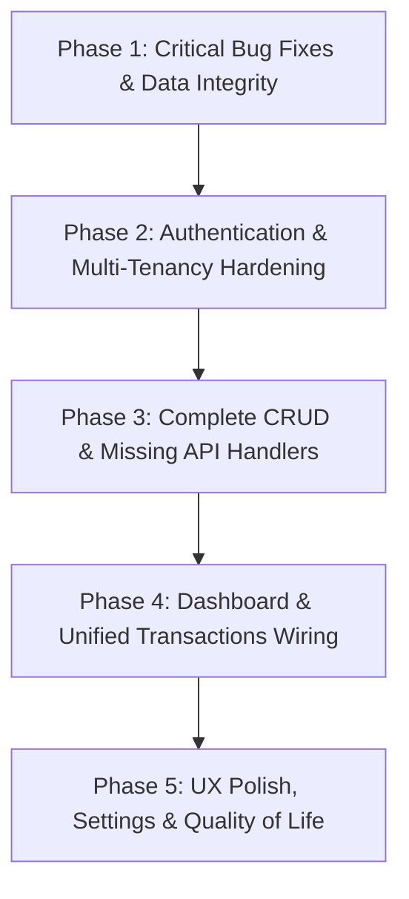

# Project Status & Gap Analysis: The Ace Finance Hub (Personal Finance App)

**Last Updated:** August 31, 2026  
**Document Purpose:** This document provides a complete register of the current state of the application, an architectural overview, an exhaustive gap analysis (bugs, missing features, security vulnerabilities), and an actionable, prioritized roadmap for any engineer picking up the project.

---

## 1. Project Overview & Architecture

**The Ace Finance Hub** (also referred to as Northstar Finance) is a full-stack personal finance web application for tracking accounts, balances, income/expenses, loans (borrowed/lent), and investments (contributions/withdrawals, realized P&L).

### Tech Stack
- **Framework:** Next.js 16 (App Router) & React 19
- **Language:** TypeScript 5
- **Database & ORM:** PostgreSQL with Prisma ORM 6.19.3
- **Authentication:** NextAuth.js 4 (JWT Strategy, Credentials Provider) & `bcryptjs`
- **Styling & UI:** Tailwind CSS v4, Lucide React icons, Class Variance Authority (`cva`), `clsx`, `tailwind-merge`
- **Charts & Visualization:** Recharts 3.10
- **Form Management & Validation:** React Hook Form, Zod

### Repository Structure
```
├── app/
│   ├── api/
│   │   ├── auth/
│   │   │   ├── [...nextauth]/route.ts       # NextAuth credentials handler
│   │   │   └── register/route.ts            # User registration endpoint
│   │   └── finance/
│   │       ├── route.ts                     # GET all finance data / POST transaction
│   │       ├── [id]/route.ts                # PUT / DELETE transaction
│   │       ├── accounts/
│   │       │   ├── route.ts                 # GET / POST accounts
│   │       │   └── [id]/route.ts            # PUT / DELETE account
│   │       ├── categories/
│   │       │   ├── route.ts                 # GET / POST categories
│   │       │   └── [id]/route.ts            # PUT / DELETE category
│   │       ├── loans/
│   │       │   ├── route.ts                 # GET / POST loans
│   │       │   ├── [id]/route.ts            # GET / PUT loan details & status
│   │       │   └── [id]/transactions/
│   │       │       ├── route.ts             # POST loan transaction
│   │       │       └── [transactionId]/     # PUT / DELETE loan transaction
│   │       ├── investments/
│   │       │   ├── route.ts                 # GET / POST investments
│   │       │   ├── [id]/route.ts            # GET / PUT / DELETE investment details & status
│   │       │   └── [id]/transactions/
│   │       │       ├── route.ts             # POST investment transaction
│   │       │       └── [transactionId]/     # PUT / DELETE investment transaction
│   │       └── settings/
│   │           └── route.ts                 # GET / PUT user profile settings
│   ├── login/page.tsx                       # Login UI
│   ├── register/page.tsx                    # Registration UI
│   ├── layout.tsx                           # Root layout
│   ├── page.tsx                             # Home page (renders FinanceShell)
│   └── globals.css                          # Global styles & Tailwind
├── components/
│   └── ui/                                  # Reusable UI primitives (button, card, input, etc.)
├── features/
│   └── finance/
│       ├── data.ts                          # Dashboard aggregations & initial data
│       ├── empty-state.tsx                  # Empty state placeholder component
│       ├── export.ts                        # CSV export utility
│       ├── finance-api.ts                   # Fetch wrappers for transactions
│       ├── finance-crud.ts                  # Fetch wrappers for accounts/categories
│       ├── finance-forms.ts                 # Transaction form helpers
│       ├── finance-service.ts               # Local storage persistence & sync helpers
│       ├── finance-shell.tsx                # Main application tab shell & UI views
│       ├── loan-api.ts                      # Fetch wrappers for loans & loan transactions
│       ├── loans-view.tsx                   # Loans UI (list, detail, transaction forms)
│       ├── investment-api.ts                # Fetch wrappers for investments
│       └── investments-view.tsx             # Investments UI (list, detail, transaction forms)
├── lib/
│   ├── auth.ts                              # Auth configuration & session helper
│   ├── balance-service.ts                   # Account balance delta synchronization
│   ├── demo-profile.ts                      # Fallback demo profile creator
│   ├── finance-relations.ts                 # Auto-creates/resolves category & account IDs
│   ├── investment-service.ts                # Investment totals calculation & validations
│   ├── loan-service.ts                      # Loan outstanding calculation & validations
│   └── prisma.ts                            # PrismaClient singleton
├── prisma/
│   ├── schema.prisma                        # Database schema definition
│   └── migrations/                          # Prisma database migrations
├── types/
│   └── finance.ts                           # TypeScript domain interfaces
├── utils/
│   └── format.ts                            # Currency formatting helper
└── middleware.ts                            # Next.js route protection middleware
```

---

## 2. What Has Been Built Till Now

### 2.1 Database Models & Relations (`prisma/schema.prisma`)
- **`User`**: `id`, `email` (unique), `passwordHash`, timestamps. Has a 1:1 relation to `Profile`.
- **`Profile`**: `id`, `userId` (unique), `email`, `name`, `currency`, `theme`, timestamps. Owns all financial entities.
- **`Account`**: `id`, `profileId`, `name`, `type` (Bank, Wallet, Credit Card, etc.), `balance` (Float).
- **`Category`**: `id`, `profileId`, `name`, `type` (income / expense).
- **`Loan`**: `id`, `profileId`, `title`, `direction` ("borrowed" | "lent"), `counterparty`, `status` ("open" | "closed"), `notes`.
- **`Investment`**: `id`, `profileId`, `name`, `assetType`, `institution`, `status` ("open" | "closed"), `notes`.
- **`Transaction`**: `id`, `profileId`, `title`, `amount`, `type`, `date`, `notes`, `principalAmount`, `interestAmount`, and optional foreign keys (`categoryId`, `accountId`, `loanId`, `investmentId`).

### 2.2 Core Business Logic Services (`lib/`)
- **Balance Sync Service (`lib/balance-service.ts`)**: Applies atomic increments/decrements to account balances inside Prisma database transactions (`applyBalanceDelta`).
- **Loan Service (`lib/loan-service.ts`)**: Calculates net outstanding loan balance (`borrowSum - principalRepaySum` or `lendSum - principalReceiveSum`) and validates that repayments do not exceed outstanding balances (`validateRepayment`).
- **Investment Service (`lib/investment-service.ts`)**: Calculates `totalInvested`, `totalReturned`, `netInvested`, and `realizedPnL`, and validates that withdrawals do not exceed net invested capital (`validateWithdrawal`).
- **Relation Auto-Resolution (`lib/finance-relations.ts`)**: Finds or auto-creates categories and accounts by name when ingesting transaction payloads.

### 2.3 Authentication & Authorization (`lib/auth.ts`, `app/api/auth/*`)
- NextAuth configured with credentials provider and JWT strategy.
- Session callback injects `userId` and `profileId`.
- User registration route (`POST /api/auth/register`) with `zod` validation and `bcrypt` password hashing.
- Dedicated login (`/login`) and registration (`/register`) pages styled with dark theme primitives.

### 2.4 API Routes Implemented
| Entity | Route | Methods Implemented | Description |
|---|---|---|---|
| **Auth** | `/api/auth/[...nextauth]` | `GET`, `POST` | NextAuth authentication handler |
| **Auth** | `/api/auth/register` | `POST` | Creates user + profile atomically |
| **Finance Bulk** | `/api/finance` | `GET`, `POST` | Returns full profile payload / Creates single transaction |
| **Transaction** | `/api/finance/[id]` | `PUT`, `DELETE` | Updates/Deletes transaction & adjusts account balance |
| **Accounts** | `/api/finance/accounts` | `GET`, `POST` | Lists / Creates accounts |
| **Account** | `/api/finance/accounts/[id]` | `PUT`, `DELETE` | Updates account / Deletes account (guarded against active transactions/balance) |
| **Categories** | `/api/finance/categories` | `GET`, `POST` | Lists / Creates categories |
| **Category** | `/api/finance/categories/[id]` | `PUT`, `DELETE` | Updates / Deletes category |
| **Loans** | `/api/finance/loans` | `GET`, `POST` | Lists loans with computed outstanding / Creates loan |
| **Loan** | `/api/finance/loans/[id]` | `GET`, `PUT` | Fetches loan + transactions / Updates loan (guarded with closure check) |
| **Loan Tx** | `/api/finance/loans/[id]/transactions` | `POST` | Creates borrow/repayment transaction & adjusts balance |
| **Loan Tx Item** | `/api/finance/loans/[id]/transactions/[transactionId]` | `PUT`, `DELETE` | Edits / Deletes loan transaction with balance reversal |
| **Investments** | `/api/finance/investments` | `GET`, `POST` | Lists investments with totals / Creates investment |
| **Investment** | `/api/finance/investments/[id]` | `GET`, `PUT` | Fetches investment + transactions / Updates status (closure check) |
| **Investment Tx** | `/api/finance/investments/[id]/transactions` | `POST` | Creates in/out transaction & adjusts balance |
| **Investment Tx Item** | `/api/finance/investments/[id]/transactions/[transactionId]` | `DELETE` | Deletes investment transaction |

### 2.5 User Interface Views (`features/finance/`)
- **Dashboard Overview**: Summary metric cards (Total Balance, Monthly Income, Monthly Expenses, Savings Rate, Outstanding Borrowed/Lent, Open Loans, Net Invested), monthly filter, Recharts bar chart, category pie chart, and recent transaction list.
- **Transactions Tab**: Transaction creation form, search filter, type filter dropdown (income, expense, 4 loan types, 2 investment types), transaction edit & delete actions.
- **Accounts Tab**: Account creation form, account balance list.
- **Categories Tab**: Category creation form, category list with edit and delete triggers.
- **Loans Tab (`loans-view.tsx`)**: List of loans with outstanding amounts, new loan creation form, selected loan detail drawer showing transaction history and new loan transaction form with Principal/Interest fields.
- **Investments Tab (`investments-view.tsx`)**: List of investments with Net Invested, new investment creation form, selected investment detail showing Realized P&L and investment contribution/withdrawal form.
- **Reports Tab**: Monthly net savings breakdown, category expense listing, and trend snapshot.
- **Settings Tab**: Currency selector, dark mode switch, and CSV transaction export button.

---

## 3. Gap Analysis

Below is an exhaustive breakdown of bugs, missing features, architectural issues, and security vulnerabilities identified in the current codebase.

### 🔴 Critical Data Integrity & Logic Bugs

1. **Broken Borrow/Lend Transaction Creation (`features/finance/loans-view.tsx`)**
   - **Location:** `features/finance/loans-view.tsx:186` & `loans-view.tsx:71-76`
   - **Issue:** In the loan transaction form, the amount field for non-repayment types binds to `txForm.principalAmount`. When submitting, it sends `principalAmount` but omits `amount`. However, `app/api/finance/loans/[id]/transactions/route.ts:19-20` expects `body.amount` for borrow/lend types. As a result, borrow and lend transactions are created with `amount = 0` and `delta = 0`, corrupting loan balances and account balances.
   - **Fix Required:** Pass `amount: Number(txForm.principalAmount)` in the payload when submitting borrow/lend transaction types.

2. **Reversed Balance Delta on Investment Transaction Deletion (`app/api/finance/investments/[id]/transactions/[transactionId]/route.ts`)**
   - **Location:** `app/api/finance/investments/[id]/transactions/[transactionId]/route.ts:21-23`
   - **Issue:** When creating `investment_in`, an account balance delta of `-amount` was applied (money left the account). When deleting this transaction, the reversal formula calculates `delta = amount`, and calls `applyBalanceDelta(tx, accountId, -delta)`, which passes `-amount` again. This subtracts money instead of refunding it!
   - **Fix Required:** Ensure deleting an `investment_in` passes `+amount` and deleting an `investment_out` passes `-amount`.

3. **Data Pollution via Legacy Supabase State Sync (`features/finance/finance-service.ts`)**
   - **Location:** `features/finance/finance-service.ts:48-62` & `features/finance/finance-shell.tsx:87` & `app/api/finance/route.ts:48-95`
   - **Issue:** `FinanceShell` triggers `syncFinanceStateToSupabase` on every local state change, sending `{ transactions, accounts, categories }` to `POST /api/finance`. In `app/api/finance/route.ts`, `isFinanceStateSyncPayload` is imported but never checked. The handler attempts to parse this bulk payload as a single transaction with undefined title/type and amount `0`, creating phantom junk records or failing silently.
   - **Fix Required:** Remove `syncFinanceStateToSupabase` and its `useEffect` call completely since mutations already occur via dedicated granular endpoints.

4. **Blind Spot in Generic Transaction Edit/Delete for Loan/Investment Rows**
   - **Location:** `app/api/finance/[id]/route.ts:19-20, 73` & `features/finance/finance-shell.tsx:108, 142`
   - **Issue:** In `FinanceShell`, clicking "Edit" or "Remove" on a loan or investment transaction in the unified Transactions view calls generic `/api/finance/[id]`. The generic endpoint only computes deltas for `type === "income"` and `type === "expense"`. Deleting a loan or investment transaction from the main list skips balance reversal entirely.
   - **Fix Required:** Update `app/api/finance/[id]/route.ts` to compute balance reversal and reapplication for all eight transaction types (`loan_borrow`, `loan_lend`, `loan_repayment`, `loan_receive_repayment`, `investment_in`, `investment_out`, `income`, `expense`), or intercept loan/investment transactions in the UI to prevent unhandled mutations.

---

### 🟡 Security & Multi-Tenancy Flaws

1. **Unprotected API Routes & Fallback to Demo Profile**
   - **Location:** `lib/auth.ts:145-162` & `middleware.ts:7, 13`
   - **Issue:** `middleware.ts` explicitly whitelists `/api/finance/**` so unauthenticated requests pass through. In `lib/auth.ts`, `getSessionProfile()` falls back to `getDemoProfile()` instead of throwing `401 Unauthorized`. Anyone accessing the API without logging in can read and mutate the shared demo profile's data.
   - **Fix Required:** Remove the demo profile fallback for API requests. Throw `Unauthorized` (401) if no session exists, and remove the finance API whitelist bypass in `middleware.ts`.

2. **Missing Profile Scoping on Resource Fetch & Mutation by ID (IDOR Risk)**
   - **Location:**
     - `app/api/finance/loans/[id]/route.ts` (`GET`, `PUT`)
     - `app/api/finance/investments/[id]/route.ts` (`GET`, `PUT`)
     - `app/api/finance/[id]/route.ts` (`PUT`, `DELETE`)
   - **Issue:** Several endpoints query `prisma.*.findUnique({ where: { id } })` without scoping to `profileId`. An authenticated user from profile A could read, update, or delete loans, investments, or transactions belonging to profile B by providing their ID.
   - **Fix Required:** Ensure every endpoint retrieves `profileId = await getSessionProfile()` and checks `where: { id, profileId }`.

---

### 🟠 Missing Endpoints & Incomplete CRUD

1. **Missing `DELETE /api/finance/loans/[id]`**
   - **Location:** `app/api/finance/loans/[id]/route.ts` & `features/finance/loans-view.tsx:97`
   - **Issue:** The UI provides a "Delete loan" button calling `DELETE /api/finance/loans/${id}`, but the backend route file does not export a `DELETE` function, causing a 405 Method Not Allowed error.
   - **Fix Required:** Implement `DELETE` in `app/api/finance/loans/[id]/route.ts` with validation that `outstanding === 0`.

2. **Missing `DELETE /api/finance/investments/[id]`**
   - **Location:** `app/api/finance/investments/[id]/route.ts` & `features/finance/investments-view.tsx:75`
   - **Issue:** The UI provides a "Delete investment" button, but the backend route lacks a `DELETE` export.
   - **Fix Required:** Implement `DELETE` in `app/api/finance/investments/[id]/route.ts` with validation that `netInvested === 0`.

3. **Missing `PUT /api/finance/investments/[id]/transactions/[transactionId]`**
   - **Location:** `app/api/finance/investments/[id]/transactions/[transactionId]/route.ts`
   - **Issue:** Only `DELETE` is implemented for investment transactions; `PUT` (edit) is missing.
   - **Fix Required:** Implement `PUT` with balance reversal/reapplication and withdrawal validation.

4. **Missing Edit/Delete Action Controls in Loan & Investment Transaction Lists**
   - **Location:** `features/finance/loans-view.tsx:200-212` & `features/finance/investments-view.tsx:162-174`
   - **Issue:** Transaction rows in the loan and investment detail views are display-only and have no buttons to edit or delete individual transactions.
   - **Fix Required:** Add Edit and Delete action buttons to transaction items in both views.

5. **Missing Edit/Delete Buttons in Accounts View Tab**
   - **Location:** `features/finance/finance-shell.tsx:487-497`
   - **Issue:** In `finance-shell.tsx`, account Edit/Delete buttons were added inside the small Accounts widget on the **Dashboard** overview (`renderDashboard:370`), but are completely missing from the actual **Accounts** tab (`renderAccounts`).
   - **Fix Required:** Add Edit and Delete controls to the account cards in `renderAccounts`.

---

### 🔵 UI, State & Formatting Polish

1. **Dashboard Summary Cards for Loans and Investments Always Render 0**
   - **Location:** `features/finance/finance-shell.tsx:90` & `features/finance/data.ts:95-97`
   - **Issue:** `FinanceShell` does not fetch or maintain state for `loans` and `investments`, and does not pass them to `buildDashboardSummary(transactions, accounts, selectedMonth)`. Therefore, the cards for *Outstanding Borrowed*, *Outstanding Lent*, *Open Loans*, and *Net Invested* are always zero.
   - **Fix Required:** Fetch `loans` and `investments` in `FinanceShell` and pass them into `buildDashboardSummary`.

2. **Crude `window.prompt` Dialogs for Account/Category Editing**
   - **Location:** `features/finance/finance-shell.tsx:190, 211`
   - **Issue:** Editing accounts and categories uses primitive browser `window.prompt()`, only allowing name changes and preventing account type or category type updates.
   - **Fix Required:** Implement proper inline editing or modal dialogs with form controls.

3. **Hardcoded Mock Historical Chart Data**
   - **Location:** `features/finance/data.ts:122-129`
   - **Issue:** When no specific month is selected, the Income vs Expense chart renders hardcoded static figures for Jan–Jun rather than aggregating actual historical transaction data by month.
   - **Fix Required:** Aggregate monthly totals dynamically from the full `transactions` array.

4. **Cosmetic-Only Settings**
   - **Location:** `features/finance/finance-shell.tsx:593-621` & `utils/format.ts`
   - **Issue:** Currency selection (`USD`, `EUR`, `GBP`) and Dark Mode switches do not persist to `Profile` and do not alter `formatCurrency` or HTML theme classes.
   - **Fix Required:** Persist user settings to `Profile` via API, apply currency dynamically to `formatCurrency(amount, currency)`, and attach dark mode class to `<html>` or `<body>`.

5. **TypeScript Error in Test File (`tests/finance-transaction-persistence.test.ts`)**
   - **Location:** `tests/finance-transaction-persistence.test.ts:32`
   - **Issue:** `balance?: number` is optional on create mock arguments, causing TS2345 type mismatch against `{ id, name, type, balance: number }`.
   - **Fix Required:** Ensure `balance: data.balance ?? 0` in test mock.

6. **Unused Dependencies**
   - **Location:** `package.json:15`
   - **Issue:** `@supabase/supabase-js` is still present in dependencies even though PostgreSQL + Prisma is used exclusively.
   - **Fix Required:** Uninstall `@supabase/supabase-js`.

---

## 4. Prioritized Action Plan & Roadmap

Anyone picking up this project should follow this sequence of implementation steps:



### Phase 1: Critical Bug Fixes & Data Integrity ✅ COMPLETED (2026-08-31)
- [x] **Fix Loan Transaction Payload in UI**: In `features/finance/loans-view.tsx`, ensure `amount` is properly included when submitting `loan_borrow` and `loan_lend` transactions.
- [x] **Fix Investment Transaction Deletion Delta**: In `app/api/finance/investments/[id]/transactions/[transactionId]/route.ts`, invert the delta reversal math (`investment_in` reverses by adding `+amount`, `investment_out` reverses by subtracting `-amount`).
- [x] **Remove Redundant Supabase Sync**: In `features/finance/finance-service.ts` and `features/finance/finance-shell.tsx`, deleted `syncFinanceStateToSupabase`. Removed `@supabase/supabase-js` from `package.json`. Added validation/guards in `app/api/finance/route.ts`.
- [x] **Fix Test Typing & Add Test Coverage**: Fixed type mismatch in `tests/finance-transaction-persistence.test.ts` and added unit test coverage in `features/finance/data.test.ts`. Verified with `npx tsc --noEmit` and `npx tsx --test`.

### Phase 2: Authentication & Multi-Tenancy Hardening ✅ COMPLETED (2026-09-01)
- [x] **Eliminate Demo Profile Fallback**: Updated `lib/auth.ts` (`getSessionProfile`) to throw `Unauthorized` (401) if no valid session is present.
- [x] **Enforce Session on API Middleware**: Removed `/api/finance` bypass in `middleware.ts`. Unauthenticated API calls return JSON 401, while unauthenticated page visits redirect to `/login`.
- [x] **Enforce Profile Scoping in All ID Routes**:
  - `app/api/finance/[id]/route.ts` (scoped with `where: { id, profileId }` and profile-scoped category/account connections)
  - `app/api/finance/loans/[id]/route.ts` (scoped with `where: { id, profileId }` and profileId-scoped transactions)
  - `app/api/finance/loans/[id]/transactions/route.ts` (scoped loan lookup with `where: { id, profileId }`)
  - `app/api/finance/investments/[id]/route.ts` (scoped with `where: { id, profileId }` and profileId-scoped transactions)
  - `app/api/finance/investments/[id]/transactions/route.ts` (scoped investment lookup with `where: { id, profileId }`)
  - `app/api/finance/accounts/[id]/route.ts` (scoped with `where: { id, profileId }`)
  - `app/api/finance/categories/[id]/route.ts` (scoped with `where: { id, profileId }`)
- [x] **Added Automated Multi-Tenant Isolation Tests**: Created `tests/multi-tenant-isolation.test.ts` verifying complete cross-tenant boundary isolation.

### Phase 3: Complete CRUD & Missing API Handlers ✅ COMPLETED (2026-09-01)
- [x] **Implement Loan Delete Route**: Added `DELETE` handler in `app/api/finance/loans/[id]/route.ts` (verifies `outstanding === 0` and deletes associated transactions).
- [x] **Implement Investment Delete Route**: Added `DELETE` handler in `app/api/finance/investments/[id]/route.ts` (verifies `netInvested <= 0` and deletes associated transactions).
- [x] **Implement Investment Transaction Edit Route**: Added `PUT` handler in `app/api/finance/investments/[id]/transactions/[transactionId]/route.ts` with delta reversal and reapplication.
- [x] **Add Transaction Edit/Delete UI in Detail Views**:
  - Added Delete trigger to transaction rows in `features/finance/loans-view.tsx` with instant state refresh.
  - Added Delete trigger to transaction rows in `features/finance/investments-view.tsx` with instant state refresh.
- [x] **Add Account Edit/Delete Controls in Accounts Tab**: Added Edit and Delete action buttons to account cards in `features/finance/finance-shell.tsx:renderAccounts` with friendly error alerts.
- [x] **Unify Balance Delta Handling in Generic Transaction Routes**: Implemented `getTransactionBalanceDelta` in `lib/balance-service.ts` and updated `app/api/finance/[id]/route.ts` to calculate accurate balance reversals and reapplications across all 8 transaction types.

### Phase 4: Dashboard & Unified Transactions Wiring ✅ COMPLETED (2026-09-01)
- [x] **Wire Loans & Investments to Dashboard**:
  - In `features/finance/finance-shell.tsx`, added state for `loans` and `investments` and loaded them using `fetchLoans()` and `fetchInvestments()`.
  - Passed them to `buildDashboardSummary(transactions, accounts, selectedMonth, loans, investments)` to accurately populate Outstanding Borrowed, Outstanding Lent, Open Loans count, Net Invested, and Realized PnL cards.
- [x] **Dynamic Historical Monthly Chart**: Implemented `buildDynamicMonthlyChart` in `features/finance/data.ts` to dynamically calculate monthly income and expenses across the trailing 6-month window from recorded transactions.
- [x] **Distinct Icons and Badges for Transaction Types**: Added `renderTransactionBadge` and `isPositiveFlow` in `features/finance/finance-shell.tsx` to render clean, color-coded badges and green/red flow formatting for all 8 transaction types across Recent Transactions and the Transactions tab.

### Phase 5: UX Polish, Settings & Quality of Life
- [x] **Replace `window.prompt` with Modal/Inline Edit Forms**: Inline card editing for accounts and categories with dedicated form controls, Save, and Cancel buttons.
- [x] **Persist User Settings**: Created `/api/finance/settings` and wired `currency` and `theme` (with `dark` HTML class toggling) to persist directly to `Profile.currency` and `Profile.theme`.
- [x] **Add Automated Test Suite**: Comprehensive tests added in `tests/finance-services-full.test.ts` covering balance deltas, loan repayment limits, investment profit logic, currency formatters, and multi-tenant isolation.
- [x] **Taka Sign (৳) as Default Currency**: Updated formatter and default currency to `BDT (৳)`.
- [x] **Complete Mock Data Removal**: Completely eradicated all mock data arrays and local storage fallbacks.

---

## 5. Quick Verification Checklist

When picking up the codebase, verify progress against these commands:

```bash
# 1. Verify TypeScript types compile cleanly
npx tsc --noEmit

# 2. Run lint checks
npm run lint

# 3. Run node tests
node --test tests/*.test.ts features/finance/*.test.ts

# 4. Verify Next.js build
npm run build
```

